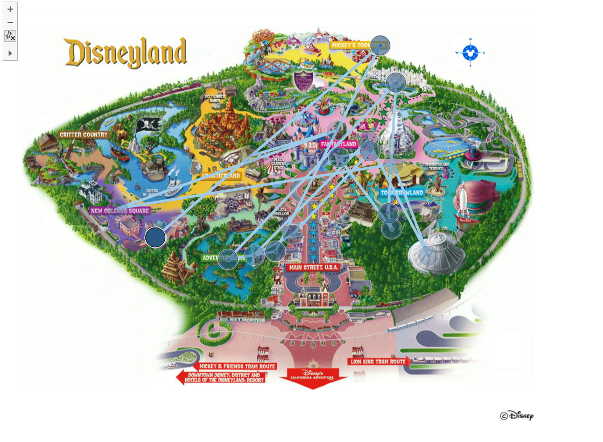
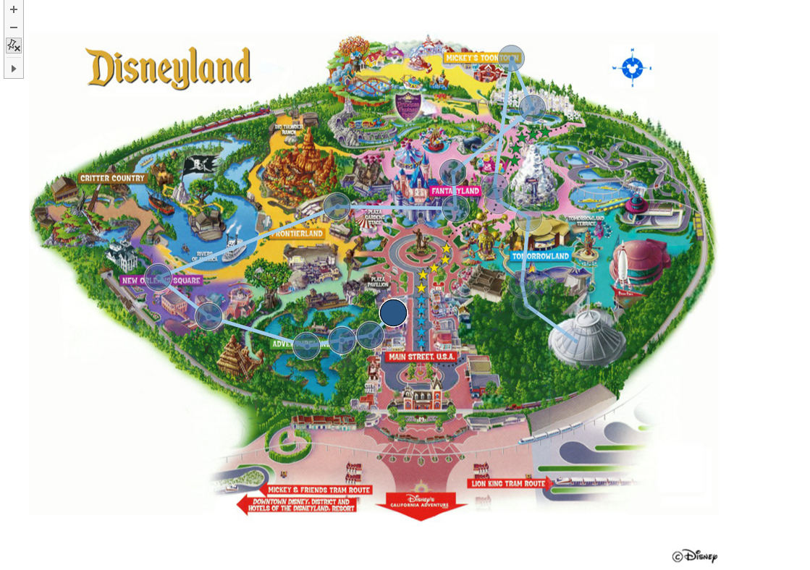
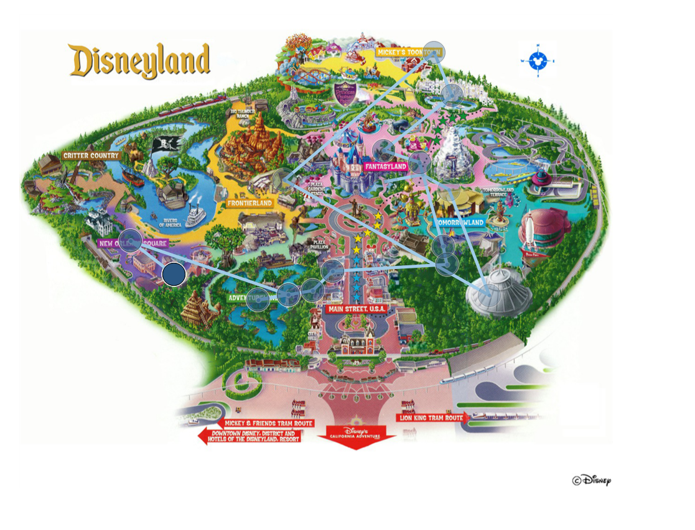

# **Disney Project -11/20/2018**
_Tags_:  
Scenario Analysis  
Tableau Geo Visualization  
Data Normalizing  
Linear Programming  

### Scenario #1: Minimization Path with equal weights to Walking Distance(m) and Wait Time(min)

### Scenario #2: Minimum Path for Wait Time(min)

### Scenario #3: Minimum Path for Walking Distance(m)

### Scenario #4: Minimum Path with Constraint on Wait Time(min) not to exceed 35 minutes

### Support or Contact

Having trouble with Pages? Check out our [documentation](https://help.github.com/categories/github-pages-basics/) or [contact support](https://github.com/contact) and we’ll help you sort it out.
